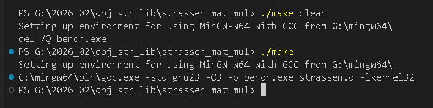

# [Strassen Matrix Multiplication](#strassen-matrix-multiplication-benchmark) Benchmark

Benchmarks comparing naive O(n^3) matrix multiplication against Strassen's O(n^2.807) algorithm using (very slightly modified) [ubench.h](https://github.com/sheredom/ubench.h).

## Requirements

- GCC 15+ with C23 support
- Tested with: `gcc.exe (MinGW-W64 x86_64-msvcrt-posix-seh, built by Brecht Sanders, r1) 15.2.0`
- `gcc_defer.h` contains Gustedt defer macro, that requires GCC

>[!Important]
>
>Built on my machine with `G:\mingw64` present. For you that is def. not a problem.


## Build & Run

Use `make.cmd` found here.

```cmd
make
```

or 

```cmd
make clean
```

Or manually:

```
G:\mingw64\bin\gcc.exe -std=gnu23 -O3 -o bench.exe strassen.c -lkernel32
```
Here is clean and build in action, on my WIN10 machine.



## Modifications to ubench.h

The upstream `ubench.h` only defines the Win32 timer types (`ubench_large_integer`, `QueryPerformanceCounter`, `QueryPerformanceFrequency`) under `_MSC_VER` (MSVC). This means compilation with MinGW fails because those types and function declarations are missing.

**Fix applied at line 104:**

```c
// upstream:
#if defined(_MSC_VER)

// patched:
#if defined(_MSC_VER) || defined(__MINGW64__) || defined(__MINGW32__)
```

Additionally, `-std=gnu23` is used instead of `-std=c23` because ubench.h uses `asm` (a GNU extension) in its `UBENCH_DECLARE_DO_NOTHING` macro.

## Appendix: The Strassen Idea

Standard matrix multiplication of two n x n matrices requires n^3 scalar multiplications. Strassen's key insight (1969) is that the product of two 2x2 matrices can be computed with **7 multiplications** instead of the usual 8, at the cost of extra additions. By applying this trick recursively — splitting each n x n matrix into four n/2 x n/2 blocks and combining them with 7 recursive multiplies instead of 8 — the total complexity drops from O(n^3) to O(n^log2(7)) ~ O(n^2.807). The trade-off is more additions and subtractions per level, but since the number of multiplications dominates at scale, the algorithm wins for sufficiently large matrices.

Jump back to [Requirements](#requirements)

---

GCC defer inspired by https://antonz.org/defer-in-c/#final-thoughts

2026 by dbj@dbj.org | CC BY SA 4.0
